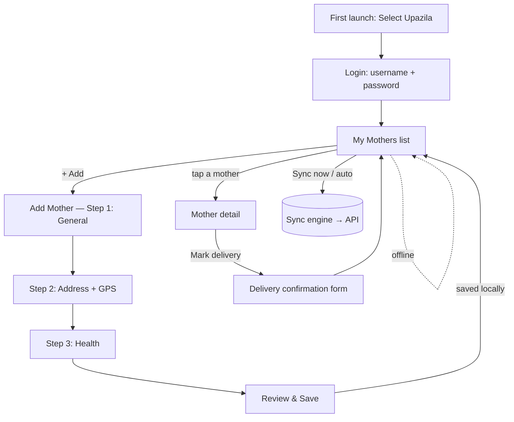

# Suraha FWA Mobile App — Design & Workflow Plan

**Goal:** an offline-first Android app for the FWA (পরিবার কল্যাণ সহকারী) to register and manage প্রসূতি (expecting mother) records in the field, syncing to the existing Suraha backend.

**Locked decisions:** Ionic **React + Capacitor** (Android first; Flutter port later) · **offline-first** (enter with no signal, auto-sync) · **full field workflow** (login → my mothers → add/edit → delivery → sync) · **distribution = signed APK** side-loaded for the pilot (Play Store later) · **v1 captures GPS only; photo capture is a later phase**.

---

## 1. Why Ionic React + Capacitor here

- **Reuses what exists:** same TypeScript, same REST API (`/api/pregnancies`), the same Bangla strings and validation rules from `web/src`. No backend rewrite.
- **Native where it matters:** Capacitor plugins give real GPS, camera, on-device SQLite, secure token storage, and network detection — packaged as a signed **APK / Play Store** Android app.
- **One mental model** for the team that already built the React web app.
- **Flutter later:** the REST contract + this workflow doc port cleanly to a Dart rewrite when desired; nothing here locks that out.

---

## 2. Architecture at a glance

```
┌────────────────────────── Android device (Capacitor) ──────────────────────────┐
│  Ionic React UI  ─────────────►  Local-first data layer  ─────► Sync engine     │
│  (screens/forms)                 • SQLite (mothers, outbox)      • on app-open   │
│         ▲                        • Filesystem (photos)           • on reconnect  │
│         │ reads local first      • auth token (Secure Storage)   • manual "sync" │
│         └──────────────────────────────────┬───────────────────────────┘        │
└────────────────────────────────────────────┼────────────────────────────────────┘
                                              │ HTTPS (Bearer) to the FWA's upazila
                                              ▼
              https://{upazila}.suraha.net/api   (existing Laravel API, unchanged)
```

**Principle:** the UI **only ever reads/writes local SQLite**. The sync engine is the *only* thing that talks to the network. This is what makes dead-zone entry reliable — the form never awaits the server.

---

## 3. Tenant / API strategy (the one real backend question)

The web resolves the upazila from the **subdomain**; a mobile app has no subdomain. Approach:

- **First launch → "Select your upazila."** The app fetches the public upazila directory and the FWA picks theirs (once). We store the resulting **API base URL** = `https://{slug}.suraha.net/api`. Every request then hits that subdomain, so **tenancy resolves exactly as it does on web — zero tenancy changes**.
- **Small backend addition needed:** a **public** `GET /api/upazilas/directory` returning `[{slug, name_bn, district_bn}]` for the picker (the existing `/upazilas` list is SEAL-gated). ~15 lines.
- Auth stays the existing **officer username/password → Bearer token** (`POST /auth/officer/login` on that subdomain). FWA already logs in this way; the app just stores the token in **Capacitor Secure Storage**.
- *Alternative considered:* a central login + `X-Upazila` header (like SEAL). Rejected — the subdomain-base approach reuses the current model with no server changes beyond the directory endpoint.

---

## 4. Offline-first data layer

### Local store (Capacitor SQLite)
- **`mothers`** — a local mirror of pregnancy records the FWA owns: all §8.1 fields, plus `local_id` (UUID, primary key on-device), `server_id` (nullable, set after sync), `sync_status` (`pending | syncing | synced | error`), `sync_error`, `updated_at`, `dirty` flag.
- **`outbox`** — queued operations: `{id, local_id, op: create|update|delivery, payload_json, attempts, last_error, created_at}`. The form writes here; the sync engine drains it.
- **`photos`** — `{id, local_id, file_uri, uploaded}` referencing image files saved via Capacitor **Filesystem** (not in SQLite blobs).

### IDs & dedup
- Every record gets a client **UUID** (`local_id`) at creation. The create request sends it as an **idempotency key** so a retry after a flaky response can't double-insert. → **Backend: accept an optional `client_uuid` on `POST /pregnancies`, unique per tenant; return the existing row if it repeats.** (~small migration + guard.)

### Sync engine
- Triggers: **app resume**, **network regained** (Capacitor Network listener), and a **manual "Sync now"** button.
- Drains the outbox FIFO: create/update/delivery → on success, set `server_id` + `sync_status=synced`; on 4xx → `error` (surface to user, needs edit); on network/5xx → leave `pending`, exponential backoff.
- **Pull refresh:** on sync, also `GET /pregnancies?since=…` to fold in server-side changes for "My Mothers." (Optional `since` filter — small backend add, or just refetch the FWA's list.)
- **True background sync** (app fully closed) is out of scope for v1 — sync-on-open + on-reconnect covers field reality. Note it as a later enhancement (Capacitor background task plugin).

### Conflict rule (keep simple)
FWA is effectively the sole author of their mothers, so **last-write-wins on the server**, and a record in `error` state is shown to the FWA to fix and re-submit. No merge UI in v1.

---

## 5. Screens & workflow



### 5.1 Select Upazila (first run only)
Searchable list from the directory endpoint; stores base URL. Re-selectable from Settings.

### 5.2 Login
FWA username + password → token in secure storage. "Remember me" keeps the session; logout clears token **but keeps unsynced local data** (with a warning if the outbox is non-empty).

### 5.3 My Mothers (home)
- Search + list of the FWA's mothers (local first, merged with server).
- Each row: name, ward/union, expected-delivery, and a **sync badge** (✓ synced / ⏳ pending / ⚠ error).
- Header shows a global **offline banner** and **pending-count / Sync now** control.
- FAB **"+ নতুন প্রসূতি"**.

### 5.4 Add Mother — 3-step stepper (mirrors the web form groups)
- **Step 1 — সাধারণ তথ্য:** mother name (bn, *required*), husband, register no, which child, age, blood group, chronic diseases. *(Only `mother_name_bn` is truly required — matches the API, so a half-filled record still saves.)*
- **Step 2 — ঠিকানা ও অবস্থান:** union, ward, address, mobile, and a **"Capture GPS"** button (Capacitor Geolocation → lat/long, shown as a pin + accuracy).
- **Step 3 — স্বাস্থ্য তথ্য:** TT vaccine count/date, LMP, gravida, prior deliveries, expected date, delivery plan, transport/money/donor readiness.
- **Review & Save** → writes to local SQLite + outbox, returns to the list with a ⏳ badge. **Never blocks on network.**

### 5.5 Mother detail + Delivery
- Read-only summary + **Edit** (re-opens the stepper) and **Mark delivery** → the delivery-confirmation fields (`delivery_status`, type, date, baby sex/weight, etc.) → queued like any other op.

### 5.6 Sync status / Settings
Pending list, last-sync time, "Sync now", change upazila, logout, app version.

---

## 6. UI / UX design language

- **Ionic Material (Android)** components; Suraha **violet** brand (`#6750A4`) as the Ionic primary; reuse the web logo/splash.
- **Bangla-first**, large type, **large touch targets (≥48dp)** — field use, outdoors, gloves, low-literacy tolerance: icons + labels, minimal free text, dropdowns/steppers over open fields.
- **Offline is a first-class state, not an error:** persistent subtle banner + per-record badges; success copy says "সংরক্ষিত — সংযোগ পেলে পাঠানো হবে."
- **Forgiving forms:** one required field; autosave draft between steps; GPS optional with a retry.
- Empty / loading / error states for every list and the sync panel.

---

## 7. Security
- Token in **Capacitor Secure Storage** (Android Keystore-backed), never in plain preferences.
- HTTPS only (the API is TLS). No caching of passwords.
- Local SQLite holds citizen health data → enable **SQLCipher** (encrypted SQLite) and clear local data on explicit logout-and-wipe.
- Respect the existing RBAC — the app only exposes FWA-permitted actions; the server remains the source of truth.

---

## 8. Reuse from the web app
- **Field list, types, validation** from `web/src/api/pregnancy.ts` + `PregnancyAdd.tsx` → port to shared TS types.
- **Bangla strings** from `web/src/i18n.ts` (`pregnancy.*`) → copy into the app's i18n.
- **API contract** identical; a thin `apiClient` (base URL + Bearer + JSON) mirrors `web/src/api/client.ts`.

---

## 9. Milestones (suggested build order)

| Phase | Deliverable |
|------|-------------|
| **0 — Scaffold** | `mobile/` Ionic React + Capacitor project, Android target, theme, run on device/emulator. |
| **1 — Connect & auth** | Upazila directory endpoint + picker; FWA login; secure token; authed API client. |
| **2 — Local data layer** | SQLite schema (mothers/outbox/photos), repository, connectivity service — **no UI yet**. |
| **3 — Core workflow** | My Mothers list + Add Mother stepper + GPS, saving **offline** to local store. |
| **4 — Sync engine** | Outbox drain, `client_uuid` idempotency, badges, auto + manual sync, error handling. |
| **5 — Delivery & edit** | Mother detail, edit, delivery confirmation (queued). |
| **6 — Harden & ship** | Bangla/accessibility polish, SQLCipher, empty/error states, Android signing, APK / Play Store internal track. |
| **Later** | True background sync; photo attachments on the report; birth-reg handoff; **Flutter port**. |

---

## 10. Small backend additions this needs (all additive, non-breaking)
1. **`GET /api/upazilas/directory`** — public upazila list for the first-run picker.
2. **`client_uuid`** accepted (optional, unique-per-tenant) on `POST /api/pregnancies` for safe retry/idempotency.
3. *(Optional)* `since`/updated filter on `GET /api/pregnancies` for efficient delta pull.

Everything else — auth, tenancy, the pregnancy schema and endpoints — is **already built and unchanged**.

---

## 11. Confirmed & remaining questions
**Confirmed:** distribution = **signed APK** side-loaded for the pilot (a self-signed release keystore; no Play account needed) · **GPS only in v1**, photo capture deferred to a later phase.

**Still to confirm before Phase 0:**
1. **One upazila per device, or can an FWA switch?** (Plan supports switching via Settings; confirm it's needed.)
2. **Min Android version** to support (affects plugin choices; default target: Android 9+).
3. **App identity:** "Suraha FWA" branding, or a distinct field-app name/icon?
